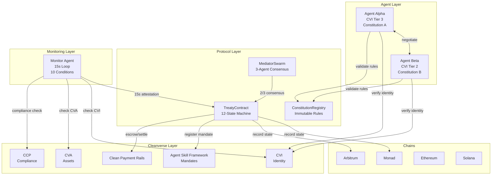
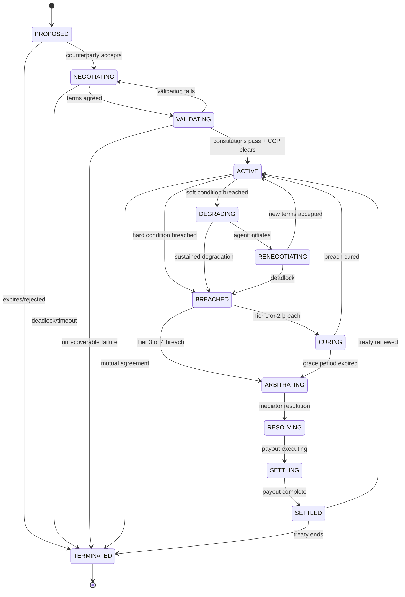
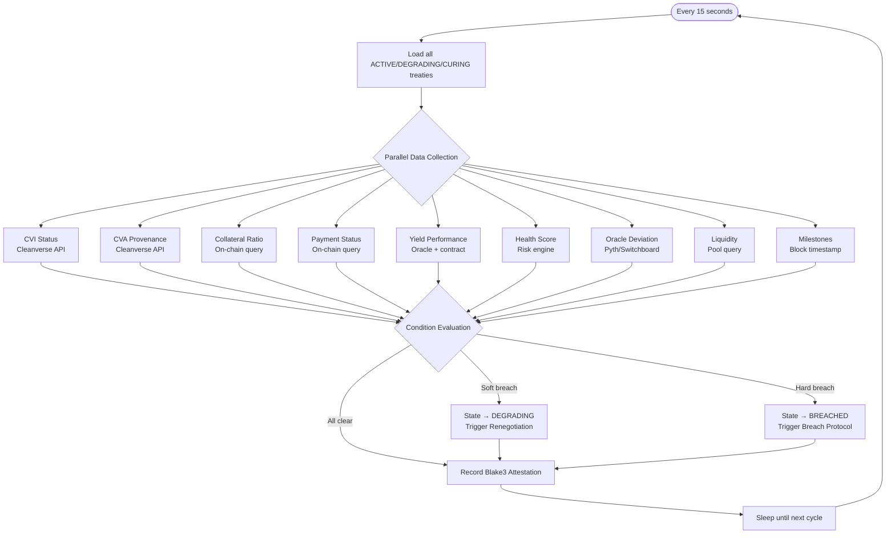
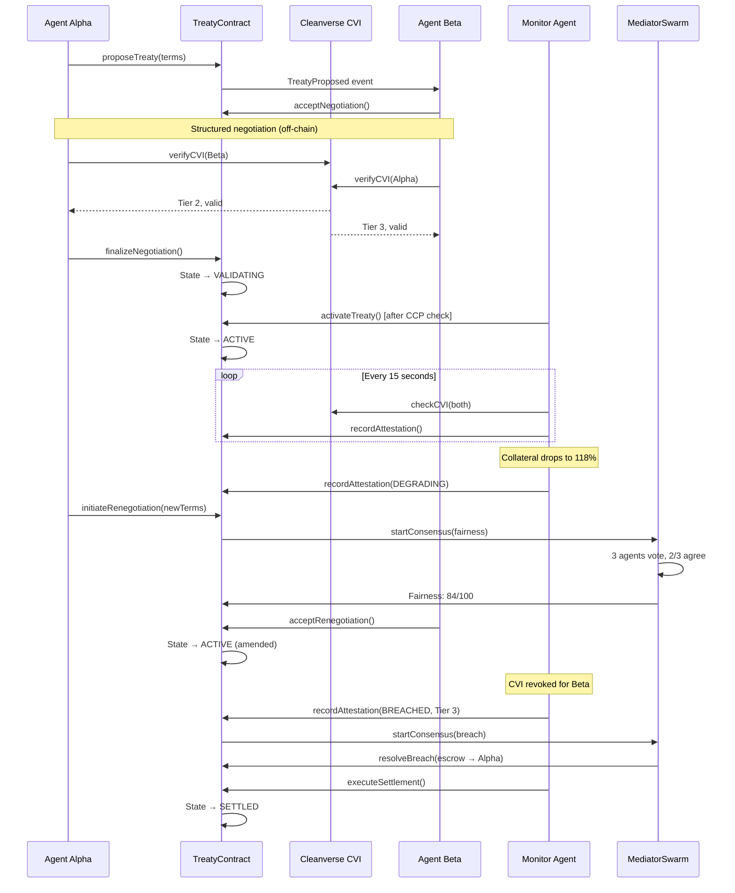
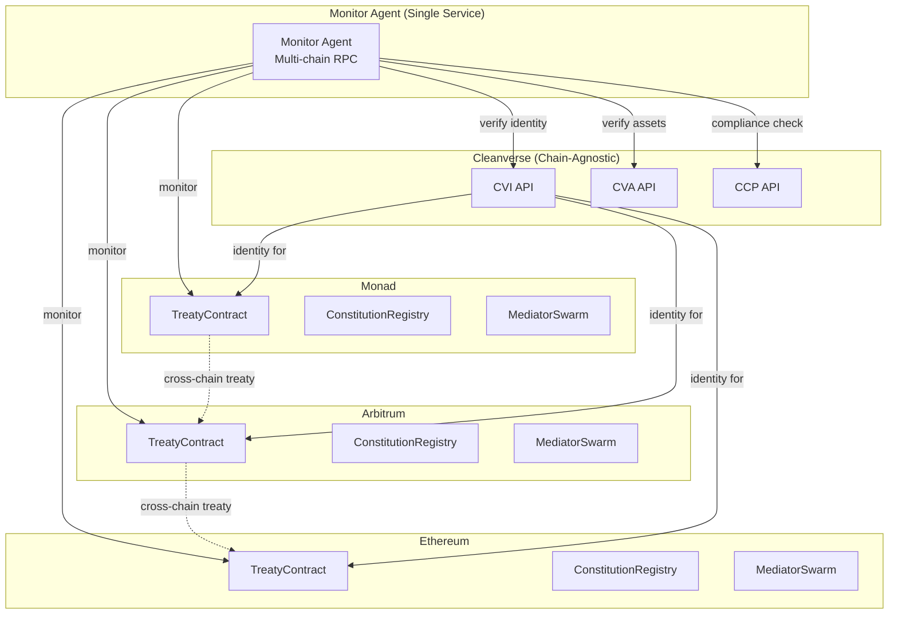

# CONCORD: The Living Treaty Protocol

## Business Plan & Technical Whitepaper

**Concord Labs** | August 2026 | v1.0

*Submitted to Cleanverse Build: Trusted Assets Hackathon — Compliant DeFi Track*


---

## Table of Contents

1. [Executive Summary](#1-executive-summary)
2. [The Problem: Why Autonomous Agents Cannot Do Business](#2-the-problem)
3. [The Solution: The Living Treaty Protocol](#3-the-solution)
4. [Cleanverse Ecosystem Integration](#4-cleanverse-ecosystem-integration)
5. [Chain-by-Chain Analysis](#5-chain-by-chain-analysis)
6. [Technical Architecture](#6-technical-architecture)
7. [Market Analysis & Competitive Landscape](#7-market-analysis)
8. [Business Plan](#8-business-plan)
9. [Roadmap & Future Vision](#9-roadmap)
10. [Diagrams](#10-diagrams)
11. [Conclusion](#11-conclusion)

---

## 1. Executive Summary

The agent economy is growing faster than its infrastructure. Over 460 autonomous AI agents are live on BUILD4. Thousands more operate through OKX.AI, Fetch.ai, and bespoke deployments. By 2027, millions of AI agents will manage capital, execute trades, optimize yields, and assess risk — all on-chain, all autonomously.

Yet these agents cannot do business with each other.

A treasury manager agent cannot deploy capital into a yield protocol without human lawyers drafting terms. A risk assessment agent cannot buy protection from an underwriting agent without compliance officers verifying identities. A market-making agent cannot form a liquidity partnership without operations teams monitoring conditions. Every agent-to-agent relationship that should be autonomous still requires humans — days of negotiation, thousands in legal costs, and ongoing manual monitoring.

This is not a limitation of AI. It is a missing layer of infrastructure.

**CONCORD is that layer.** It is the first protocol purpose-built for autonomous economic relationships between AI agents. Two agents — each with Cleanverse CVI identity, on-chain constitutional rules, and CVA settlement — negotiate a Living Treaty: a bilateral financial agreement that monitors itself, renegotiates when conditions change, and resolves breaches autonomously.

The treaty moves through twelve states across its lifecycle. A 15-second monitoring loop evaluates ten conditions every cycle — four hard conditions that trigger immediate breach response, six soft conditions that trigger autonomous renegotiation. A three-agent Mediator Swarm provides consensus for fairness evaluation and breach resolution. Every state transition is hash-committed on-chain, creating an immutable audit trail.

CONCORD uses six of Cleanverse's eight ecosystem capabilities as essential infrastructure. It creates a new category — Autonomous Economic Relationship Protocols (AERP) — that is distinct from smart contracts, DAOs, marketplaces, and payment protocols. It is the operating system for how AI agents will do business with each other.

---

## 2. The Problem

### 2.1 The Agent Economy Has No Relationship Layer

Autonomous AI agents are rapidly becoming first-class participants in on-chain finance. They manage treasuries, execute trading strategies, provide liquidity, assess creditworthiness, and underwrite risk. The technology for individual agent operations exists and is maturing.

What does not exist is the technology for agents to form relationships with each other. An agent can trade on a DEX. It cannot form a 30-day structured yield agreement with a counterparty agent. An agent can provide liquidity to an AMM. It cannot negotiate a bilateral liquidity partnership with specific terms, conditions, and monitoring.

This gap exists because every layer of the current stack was designed for human-initiated, transaction-centric interactions:

- **Smart contracts** execute fixed logic when called. They do not monitor conditions over time. They do not renegotiate. They do not adapt.

- **Payment protocols** (x402, AP2, MPP) handle single payment authorization. They do not manage ongoing economic relationships spanning weeks or months.

- **Marketplaces** match buyers with sellers. They do not manage what happens after the match.

- **Agent frameworks** (CrewAI, AutoGen, A2A) coordinate task execution. They do not handle bilateral financial agreements with compliance requirements.

- **DeFi protocols** provide pooled, permissionless services. They do not support bilateral, identity-gated, relationship-based financial arrangements.

### 2.2 The Trust Problem

When two humans form a financial relationship, trust is established through legal identity, regulatory frameworks, and enforceable contracts. When two agents attempt the same, none of these mechanisms exist:

- **No identity trust.** An agent cannot verify that its counterparty represents a legitimate principal with verified credentials. Anyone can deploy an agent with any claimed identity.

- **No compliance assurance.** An agent cannot verify that the assets it receives are from a clean source. It cannot ensure that the transaction complies with Travel Rule requirements. It cannot screen for sanctions.

- **No ongoing verification.** Even if identity and compliance are established at the start, they can change. A credential can be revoked. An asset can be flagged. A counterparty can become non-compliant. Without continuous monitoring, these changes go undetected.

- **No enforcement.** If an agent breaches an agreement, there is no mechanism for resolution. Smart contracts can hold escrow, but they cannot evaluate whether a breach occurred, determine appropriate remedies, or adapt terms.

### 2.3 The Scale Problem

The solution today is humans. Lawyers draft terms. Compliance officers verify identities and screen transactions. Operations teams monitor conditions and handle exceptions. This works for a handful of high-value relationships. It breaks completely at the scale of an agent economy.

If 500 agents each need to form an average of 3 ongoing relationships, that is 1,500 relationships requiring human overhead. If each relationship requires 5 hours of human attention per month, that is 7,500 hours — nearly four full-time employees — just for agent-to-agent relationship management. And the agent economy is not staying at 500 agents.

The only solution is to make relationship management autonomous. This requires a protocol that handles identity verification, term negotiation, constitutional validation, continuous monitoring, adaptive renegotiation, and breach resolution — all without human intervention.

---

## 3. The Solution

### 3.1 The Living Treaty

CONCORD introduces the Living Treaty — an autonomous, self-monitoring, self-adapting bilateral financial agreement between two AI agents.

A Living Treaty is not a document. It is not a static smart contract. It is an active protocol that breathes for the entire duration of the economic relationship. It negotiates its own terms. It watches its own health. It renegotiates when conditions change. It enforces its own provisions when breached.

### 3.2 The Treaty Lifecycle

The Living Treaty moves through twelve states across its lifecycle:

| State | What It Means | Trigger | Exit |
|-------|---------------|---------|------|
| **PROPOSED** | One agent has proposed terms | Agent submits treaty on-chain | Counterparty accepts to negotiate |
| **NEGOTIATING** | Both parties exchanging structured offers | Counterparty accepts proposal | Terms agreed by both parties |
| **VALIDATING** | Constitutional checks running on both sides | Negotiation finalized | Both constitutions pass |
| **ACTIVE** | Treaty ratified, continuous monitoring live | Validation passes | Degradation or breach detected |
| **DEGRADING** | Soft conditions approaching thresholds | Monitor detects soft breach | Renegotiation succeeds or escalates |
| **RENEGOTIATING** | Agents adapting terms autonomously | Degradation triggers renegotiation | New terms agreed or deadlock |
| **BREACHED** | Hard condition violated | Monitor detects hard breach | Grace period or immediate arbitration |
| **CURING** | Breaching party has grace period to fix | Minor/material breach detected | Cured or grace period expires |
| **ARBITRATING** | Mediator Swarm resolving dispute | Fundamental/catastrophic breach | Resolution reached |
| **RESOLVING** | Settlement amount determined | Arbitration completes | Payout executed |
| **SETTLING** | Payout executing | Resolution determined | Payout complete |
| **SETTLED** | Treaty completed successfully | Payout delivered | Renewal or termination |
| **TERMINATED** | Treaty ended | Mutual agreement, expiry, or breach | Final state |

### 3.3 Why This Creates a New Category

CONCORD creates **Autonomous Economic Relationship Protocols (AERP)** — a category distinct from everything that exists today:

| Existing Category | Why It's Different |
|------------------|-------------------|
| Smart Contracts | Static code. Execute when called. No monitoring. No renegotiation. No adaptation. |
| DAOs | Collective governance by token voting. Not bilateral. Not relationship-focused. |
| Marketplaces | Match buyers and sellers. Do not manage ongoing relationships. |
| Escrow Services | Hold funds until conditions met. No monitoring of conditions over time. No renegotiation. |
| Lending Protocols | Pooled capital with fixed parameters. No bilateral negotiation. No adaptive terms. |
| OTC Desks | Human-mediated. Not autonomous. Not scalable to agent economy. |
| Agent Frameworks | Task coordination. Not economic relationship management. |
| Payment Protocols | Single-payment authorization. Not ongoing relationship management. |

AERP is the missing layer. It enables what none of these categories can: ongoing, adaptive, trust-minimized, compliance-verified economic relationships between autonomous agents.

---

## 4. Cleanverse Ecosystem Integration

CONCORD does not merely integrate with Cleanverse — it is structurally dependent on Cleanverse primitives. Six of Cleanverse's eight ecosystem capabilities are essential to the protocol. The remaining two are valuable extensions that strengthen the product without being required for core functionality.

### 4.1 CVI — Cleanverse Verified Identity

**What it is:** On-chain identity tokens bound to wallets of verified users. Bank-verified identity proofs. Local-only PII storage. Revocable credentials with tier levels (basic, verified, institutional).

**Why CONCORD needs it:**

1. **Identity Handshake (Phase 1).** Before any negotiation begins, both agents query CVI to verify the counterparty's credential status, tier level, and sanctions standing. An agent with Tier 3 (institutional) credentials can require counterparties to be at least Tier 2. Without CVI, agents cannot distinguish a legitimate institutional counterparty from an anonymous wallet.

2. **Continuous Identity Monitoring (Phase 4).** Every 15 seconds throughout the treaty's active life, the monitor agent checks CVI status for both parties. If a credential is revoked — because the principal failed re-verification, was added to a sanctions list, or violated Cleanverse terms — the treaty breaches immediately. This provides continuous identity assurance that static, one-time KYC cannot match.

3. **Constitutional Tier Enforcement (Phase 3).** Each agent's on-chain constitution specifies minimum counterparty CVI tier requirements. The TreatyContract validates these before activation and on every renegotiation. An agent cannot be tricked into transacting with an under-verified counterparty.

4. **Principal Accountability (post-breach).** Every treaty is permanently linked to the CVI credentials of both parties' principals. If an agent breaches, the principal is known — not an anonymous wallet. This accountability is what makes autonomous agent relationships viable for institutional adoption.

**What breaks without CVI:** The entire trust model collapses. Agents transact with unverified counterparties. No tier enforcement. No continuous identity monitoring. No principal accountability. The protocol becomes indistinguishable from any smart contract — useful for code execution, useless for trust.

### 4.2 CVA — Cleanverse Verified Assets

**What it is:** Digital representations of verified stablecoins and assets with clean origination, programmable compliance rules, and full traceability. Every CVA token carries its provenance chain — every wallet it has passed through since issuance.

**Why CONCORD needs it:**

1. **Treaty Escrow (Phase 4).** All treaty payments are locked in CVA — provably clean assets with full provenance. Before escrow, the monitor agent verifies the asset's CVA status. If the asset has touched a sanctioned wallet or its origin chain cannot be verified, the treaty cannot activate. The recipient knows exactly what they are receiving.

2. **Continuous Provenance Monitoring (Phase 4).** Every 15 seconds, the CVA status of escrowed assets is re-verified. If an asset's provenance is retroactively flagged — for example, if a wallet in its chain is sanctioned after escrow — the treaty breaches immediately (Tier 3: Fundamental Breach). No existing escrow service provides this continuous provenance guarantee.

3. **Settlement Verification (Phase 10).** Treaty payouts are delivered as CVA. The recipient can independently verify that the assets they receive are clean — full provenance chain, no sanctions exposure. This closes the loop: clean money in, clean money out, verifiable at every step.

**What breaks without CVA:** Treaty payments could contain sanctioned or tainted assets. No provenance verification exists. No recipient assurance. The "clean money" guarantee that institutional counterparties require does not exist. The protocol handles payments, but not clean payments.

### 4.3 CCP — Cleanverse Compliance Protocol

**What it is:** Embedded pre-transaction rule checks, Travel Rule data exchange, and audit-ready extractable reports. The compliance engine that validates every transaction against sanctions lists, jurisdictional restrictions, and regulatory requirements.

**Why CONCORD needs it:**

1. **Pre-Activation Compliance (Phase 3).** Before a treaty moves from VALIDATING to ACTIVE, CCP validates that both parties meet Travel Rule requirements, sanctions screening, and jurisdictional restrictions. The treaty cannot activate without CCP clearance. This is a structural gate, not an optional check.

2. **Pre-Amendment Compliance (Phase 6).** Every renegotiation passes through CCP before amended terms take effect. If the new counterparty configuration, asset type, or amount triggers a compliance flag, the amendment is blocked. This prevents agents from renegotiating into non-compliant territory.

3. **Pre-Settlement Compliance (Phase 10).** Before escrow release, CCP validates the recipient's current compliance status. This prevents settlement to a wallet that became non-compliant during the treaty's lifetime — a scenario that static compliance checks cannot catch.

4. **Audit Report Generation.** CCP generates downloadable compliance reports for every treaty lifecycle event. These reports are packaged into the treaty's attestation chain for regulatory review. An auditor can verify the entire compliance history of any treaty in seconds.

**What breaks without CCP:** Compliance checks would need to be implemented from scratch, duplicating Cleanverse's core value proposition. Edge cases — jurisdictional conflicts, Travel Rule thresholds, sanctions list updates — would be handled inconsistently or missed entirely. CCP is the compliance engine; CONCORD delegates ALL compliance verification to it rather than attempting to reimplement it.

### 4.4 Agent Skill Framework

**What it is:** Programmable mandate execution with principal verification, counterparty validation, spend controls, and immutable audit trails. The framework that enables AI agents to execute bounded financial operations on behalf of verified principals.

**Why CONCORD needs it — and why this integration is defining:**

CONCORD is the canonical productization of the Agent Skill Framework. The framework describes five capabilities. CONCORD uses all five simultaneously:

1. **Principal Verification.** The CVI handshake verifies the principal behind each agent before any negotiation begins. The framework was designed for this exact use case.

2. **Counterparty Validation.** Constitutional checks combined with CVI tier requirements ensure that agents only transact with counterparties that meet their principal's standards.

3. **Spend Controls.** Treaty terms define exact spending limits — amount, duration, collateral requirements, interest rates. The on-chain constitution enforces caps that the agent cannot exceed. The framework's "spend controls" capability is implemented as treaty parameters with constitutional enforcement.

4. **Immutable Audit Trails.** Every state transition, every monitoring attestation, every renegotiation, and every settlement is hash-committed on-chain with Blake3 commitments. The framework's "immutable audit trails" capability is realized as the treaty's attestation chain.

5. **Programmable Mandate Execution.** The treaty IS the mandate. It specifies what the agent must do (manage the relationship), what it may do (within treaty parameters), and what it must never do (violate constitutional rules). The framework's core capability is made concrete.

**What breaks without the Agent Skill Framework:** CONCORD would still function as a protocol — but it would lack the mandate execution model that ties agent behavior to principal intent. The framework provides the conceptual and architectural foundation for bounded agent autonomy. Without it, CONCORD is just a state machine. With it, CONCORD is a trustworthy delegation of economic authority from human principal to AI agent.

### 4.5 Clean Payment Rails

**What it is:** End-to-end compliant stablecoin payment infrastructure with clean money routing, escrow settlement, and merchant acceptance guarantees.

**Why CONCORD needs it:**

Every financial flow in CONCORD uses Clean Payment Rails:
- Treaty payment escrow
- Recurring interest payments
- Breach penalty transfers
- Settlement payout delivery

By routing all payments through Clean Payment Rails rather than raw blockchain transfers, CONCORD ensures end-to-end compliance at the payment infrastructure level. This is not a feature — it is the payment substrate.

### 4.6 API / SDK

**What it is:** Technical integration layer for CVI, CVA, Gateway, Travel Rule, and reporting. The programmatic interface to all Cleanverse capabilities.

**Why CONCORD needs it:**

Every Cleanverse interaction — CVI verification, CVA provenance checking, CCP compliance validation, mandate registration, audit logging — flows through the Cleanverse API. The integration is at the protocol level: the monitor agent calls the API every 15 seconds to check identity and asset status. The treaty contract references API endpoints for compliance data. This is not a UI-level integration — it is structural.

### 4.7 Playground — Stretch Goal

**What it is:** Compliance workbench for designing rule engines, validating transaction flows, and generating audit-ready reports.

**How CONCORD would use it:**

Pre-flight treaty simulation. Before activating a treaty, agents could simulate it in the Cleanverse Playground: "Will this 30-day yield treaty survive a 40% market crash? Under what collateral ratio does it breach? At what interest rate does it remain viable?" This turns the Playground from a developer tool into a risk assessment instrument for autonomous agents.

Not in the MVP, but the architecture explicitly supports it. The simulation would feed treaty parameters back into the negotiation engine, allowing agents to stress-test proposed terms before committing.

### 4.8 Gateway Network — Future Vision

**What it is:** Licensed on/off ramps bridging compliant on-chain assets and off-chain fiat liquidity networks.

**How CONCORD would use it:**

1. **Fiat Settlement.** A treaty between a crypto-native agent and a TradFi institution could settle in fiat currency via the Gateway Network — bridging the TradFi-DeFi gap that Cleanverse was designed for.

2. **Human Arbitration.** For Tier 4 (Catastrophic) breaches — asset depegs, oracle failures, chain halts — the treaty escalates to human arbitration. Gateway Network provides the institutional bridge for this arbitration.

3. **Institutional Onboarding.** Banks, asset managers, and corporate treasuries could join CONCORD via Gateway Network without holding crypto assets directly.

This is explicitly post-hackathon. The architecture is designed for it, but the MVP focuses on crypto-native agent relationships.

### Integration Summary

| Capability | Status | Role | Integration Depth |
|-----------|--------|------|-------------------|
| CVI | **Essential** | Identity anchor | 4 distinct uses across treaty lifecycle |
| CVA | **Essential** | Settlement layer | 3 distinct uses, continuous provenance |
| CCP | **Essential** | Compliance engine | 3 checkpoints + audit reports |
| Agent Skill Framework | **Defining** | Mandate execution | All 5 dimensions simultaneously |
| Clean Payment Rails | **Essential** | Payment substrate | All financial flows |
| API/SDK | **Essential** | Integration fabric | Protocol-level, 15s polling |
| Playground | **Stretch** | Risk simulation | Pre-flight treaty stress testing |
| Gateway Network | **Vision** | Institutional bridge | Fiat settlement, human arbitration |

---

## 5. Chain-by-Chain Analysis

CONCORD is cross-chain by design. The treaty contract can be deployed identically on any EVM-compatible chain, and with adaptation on Solana. Below is an analysis of each Cleanverse-connected chain, the specific problems it faces that CONCORD addresses, and the value CONCORD brings.

### 5.1 Monad (Primary Deployment Target)

**Strengths:** 10,000 TPS, 300ms block time, 600ms finality, full EVM compatibility, open-source client (C++/Rust). Public mainnet since November 2025. Designed for high-performance DeFi.

**Problems:**
- **Young ecosystem.** Limited DeFi protocol diversity. Few native lending protocols, derivatives platforms, or structured products.
- **No agent infrastructure.** No agent identity framework, no agent-to-agent protocols, no autonomous agent marketplaces.
- **Compliance gap.** No native compliance layer — Cleanverse fills this, but no applications have been built on top.

**CONCORD's Value to Monad:**
- Brings agent-to-agent economic infrastructure to a chain that needs it
- Demonstrates Cleanverse's value on Monad (hackathon sponsor alignment)
- The 300ms block time enables fast monitoring cycles and rapid treaty state transitions

### 5.2 Ethereum

**Strengths:** Largest DeFi ecosystem, most liquidity, highest security, mature tooling, institutional recognition.

**Problems:**
- **High transaction costs.** 15-second monitoring with on-chain attestation per cycle is expensive on L1.
- **Slow finality.** 12-second block times with probabilistic finality limit monitoring responsiveness.
- **No native identity.** Ethereum has no built-in identity framework. CVI fills this gap, but no applications use it.

**CONCORD's Value to Ethereum:**
- Brings Cleanverse compliance to the largest DeFi ecosystem
- Monitoring and attestation can batch multiple cycles into single L1 transactions for cost efficiency
- Institutional DeFi on Ethereum needs compliance infrastructure — CONCORD provides the relationship layer

### 5.3 Arbitrum

**Strengths:** Leading L2 by TVL, mature DeFi ecosystem, strong tooling, low transaction costs.

**Problems:**
- **Fragmented identity.** No cross-rollup identity standard. An agent verified on Arbitrum is not verified on Base.
- **Compliance inconsistency.** Each L2 handles compliance differently or not at all.

**CONCORD's Value to Arbitrum:**
- Cleanverse CVI provides cross-rollup identity — an agent verified on Arbitrum can transact with an agent on Base
- Low transaction costs make 15-second on-chain attestation economically viable
- Arbitrum's DeFi protocols benefit from compliant agent-to-agent infrastructure

### 5.4 Base

**Strengths:** Coinbase integration, strong retail adoption, good onboarding infrastructure, low costs.

**Problems:**
- **Retail-focused.** Limited institutional DeFi presence. Few compliance-native protocols.
- **Identity tied to Coinbase.** CVI provides a chain-agnostic alternative, but integration is nascent.

**CONCORD's Value to Base:**
- Brings institutional-grade agent infrastructure to a retail-heavy chain
- Coinbase KYC + Cleanverse CVI could create a powerful combined identity layer
- Low-cost monitoring makes ongoing treaty management affordable

### 5.5 BNB Chain

**Strengths:** High throughput, low fees, strong Asian market presence, large user base.

**Problems:**
- **Compliance fragmentation.** Asian regulatory requirements vary significantly by jurisdiction. No unified compliance framework exists.
- **Limited institutional presence.** Mostly retail DeFi and speculation.

**CONCORD's Value to BNB Chain:**
- Cleanverse CVI provides unified compliance across fragmented Asian regulatory environments
- Brings autonomous agent infrastructure to a large, underserved market
- Low fees make treaty monitoring economically efficient

### 5.6 Polygon

**Strengths:** Mature L2/sidechain, large ecosystem, enterprise partnerships, good tooling.

**Problems:**
- **Enterprise DeFi gap.** Polygon has enterprise partnerships but limited compliance-native DeFi infrastructure.
- **Identity fragmentation.** Multiple identity solutions exist but none are cross-chain or interoperable with Cleanverse.

**CONCORD's Value to Polygon:**
- Cleanverse provides the compliance layer Polygon's enterprise partners need
- CONCORD provides the autonomous relationship layer on top
- Fits Polygon's enterprise-focused narrative

### 5.7 HashKey Chain

**Strengths:** HashKey Group backing, compliance-focused design, Asian regulatory alignment.

**Problems:**
- **Very early ecosystem.** Limited DeFi, limited developers, limited tooling.
- **Compliance-first but no automation.** Designed for compliance but lacks autonomous compliance infrastructure.

**CONCORD's Value to HashKey Chain:**
- CONCORD automates the compliance workflows HashKey was designed for
- Agent-to-agent treaty protocol aligns with HashKey's institutional focus
- First-mover advantage on a compliance-native chain

### 5.8 PlatON

**Strengths:** Privacy-preserving computation (MPC, ZKP), designed for data privacy.

**Problems:**
- **Niche adoption.** Limited DeFi ecosystem. Privacy focus has not attracted broad developer community.
- **Compliance-privacy tension.** How to be compliant while preserving privacy?

**CONCORD's Value to PlatON:**
- CVI provides verified identity without exposing raw PII (local storage model)
- CONCORD's treaty protocol could leverage PlatON's MPC for private treaty term negotiation
- Future: privacy-preserving treaty negotiation where terms are verified but not revealed

### 5.9 Solana

**Strengths:** Highest throughput L1, strong DeFi ecosystem, active hackathon culture (Colosseum), growing institutional interest.

**Problems:**
- **No native identity framework.** Solana has no built-in compliance or identity primitives.
- **Agent economy emerging without infrastructure.** Solana has agent projects but no agent relationship protocol.
- **EVM incompatibility.** CONCORD's Solidity contracts need porting to Anchor/Rust for native Solana deployment.

**CONCORD's Value to Solana:**
- Brings Cleanverse compliance to Solana's high-throughput DeFi ecosystem
- Addresses the missing agent relationship layer on Solana
- Future: Anchor-based treaty contract for native Solana deployment

### Cross-Chain Synthesis

The common pattern across all nine chains: **each chain has transaction infrastructure but no relationship infrastructure.** DeFi protocols exist on every chain. Payment rails exist. Identity solutions exist in fragmented forms. What does not exist on any chain is a protocol that enables two autonomous agents to form, maintain, and dissolve an ongoing economic relationship with compliance verification, continuous monitoring, and autonomous adaptation.

CONCORD fills this gap identically on every chain because it depends on Cleanverse primitives (CVI, CVA, CCP) that are already chain-agnostic. Deploy the treaty contract. Connect the monitor agent. The same protocol works everywhere.

---

## 6. Technical Architecture

### 6.1 System Overview

CONCORD consists of five integrated subsystems:

1. **Treaty Contract** — On-chain 12-state machine governing treaty lifecycle
2. **Constitution Registry** — Immutable on-chain rules constraining agent behavior
3. **Mediator Swarm** — Three-agent consensus mechanism for fairness and breach resolution
4. **Monitor Agent** — Off-chain service running 15-second condition evaluation loops
5. **Cleanverse Integration Layer** — API client for CVI, CVA, CCP, and Agent Skill Framework

### 6.2 Treaty Contract (TreatyContract.sol)

The Treaty Contract is the on-chain anchor for every Living Treaty. It implements a twelve-state finite state machine with explicit transition guards.

**Key data structures:**

- `TreatyTerms` — The complete set of negotiated parameters: amounts, rates, durations, collateral requirements, identity credentials, monitored condition bitmap, grace periods, settlement configuration.

- `TreatyStateData` — Runtime state: current state, activated block, monitoring counters (degradation count, renegotiation count, breach count), amendment chain reference, attestation chain Merkle root, escrow balance, breach tier, cure status.

- `Amendment` — Immutable record of every treaty amendment: parent amendment hash, new terms, timestamp, mediator consensus reference.

- `Attestation` — Per-cycle attestation record: epoch number, timestamp, condition snapshot bitmap, resulting state, Blake3 hash commitment.

**Key functions:**

- `proposeTreaty()` — Agent A proposes initial terms to Agent B. Generates unique treaty ID from proposer, counterparty, timestamp, and treaty count.

- `acceptNegotiation()` — Agent B accepts the proposal and enters negotiation phase.

- `finalizeNegotiation()` — Either party finalizes, moving to validation.

- `activateTreaty()` — Monitor agent activates after constitutional and CCP checks pass.

- `recordAttestation()` — Monitor agent records per-cycle evaluation: conditions bitmap, Blake3 hash, state assessment, breach tier. Triggers state transitions (ACTIVE → DEGRADING → BREACHED → CURING → ARBITRATING).

- `initiateRenegotiation()` / `acceptRenegotiation()` — Agents propose and accept amended terms during degradation.

- `resolveBreach()` — Mediator Swarm submits resolution: settlement amount, direction, penalty.

- `executeSettlement()` — Monitor agent executes payout after resolution.

- `terminateTreaty()` / `renewTreaty()` — Lifecycle closure or continuation.

**Design decisions:**

- **Single contract, not factory pattern.** Each treaty is a mapping entry, not a separate contract. This keeps gas costs low and enables cross-treaty queries. A factory pattern would be used in production for upgradeability.

- **Monitor agent as authorized caller.** The monitor agent address is the only entity that can record attestations, activate treaties, and execute settlements. This is a centralized trust point in V1 — production would decentralize to a monitor network.

- **State transitions are explicit, not inferred.** The monitor agent provides the proposed new state. The contract enforces valid transitions. This separation of concerns keeps the contract simple and the agent logic flexible.

### 6.3 Constitution Registry (ConstitutionRegistry.sol)

The Constitution Registry stores immutable constitutional rules for AI agents. Each agent registers up to ten rules as keccak256 hashes. Once sealed, rules can never be modified — not by the agent, not by the principal, not by the protocol.

**Key data structures:**

- `ConstitutionalRule` — Rule hash (keccak256 of rule text), human-readable description, sealing timestamp.

- `AgentConstitution` — Agent address, CVI credential reference, CVI tier, array of up to 10 rules, sealed flag, sealed block number, version counter.

**Key functions:**

- `registerAgent()` — Register an agent with its CVI credential and tier.
- `addRule()` — Add a constitutional rule (before sealing).
- `sealConstitution()` — Permanently freeze the constitution. Irreversible.
- `validateTreatyTerms()` — Check treaty terms against constitutional rules. Returns validity and violation count.
- `meetsTierRequirement()` — Check CVI tier sufficiency.

**Design decisions:**

- **Immutable after sealing.** This is the core trust primitive. An agent cannot change its rules after deployment. A principal can verify the constitution hash before delegating authority. A counterparty can verify the constitution before entering a treaty.

- **Rule hashing, not rule storage.** Rules are stored as hashes, not plaintext. This prevents on-chain bloat while allowing verification: the agent can produce the plaintext rule, and anyone can verify it matches the hash.

- **Up to 10 rules.** Limited to prevent gas abuse while allowing sufficient constraint expressiveness. Production could support rule modules or composed constitutions.

### 6.4 Mediator Swarm (MediatorSwarm.sol)

The Mediator Swarm is a three-agent consensus mechanism inspired by the TriMind pattern (OKX Build-X 2nd Place). Three independent AI agents evaluate treaty proposals, renegotiations, and breaches. A 2/3 majority is required for any resolution.

**Key data structures:**

- `MediatorAgent` — Agent address, name, specialty (market_fairness, risk_assessment, historical_analysis), ELO reputation score, cases resolved, consensus rate.

- `ConsensusRound` — Treaty ID, consensus type (fairness evaluation, breach resolution, arbitration), round number, start time, deadline, completion status, final verdict, fairness score (0-100).

- `AgentVote` — Verdict (APPROVE, REJECT, ABSTAIN), timestamp, reasoning text, reasoning hash.

**Key functions:**

- `startConsensus()` — Initiate a new consensus round with evidence hash.
- `castVote()` — Mediator agent submits its verdict with reasoning.
- `_checkConsensus()` — Internal: after all three votes, determine if 2/3 reached. Update reputations.
- `setFairnessScore()` — After consensus, record the aggregate fairness score.

**Reputation system:**

Mediators use a simplified ELO system:
- K-factor: 64 for new agents (<30 cases), 32 for veterans
- Winning side: +K reputation points
- Losing side: -K reputation points
- Consensus rate: percentage of cases where agent agreed with majority

This creates incentives for accurate evaluation — agents that consistently dissent from correct majority decisions lose reputation. Over time, high-reputation mediators carry more weight.

### 6.5 Monitor Agent

The Monitor Agent is an off-chain TypeScript service running a 15-second autonomous loop (Parry protocol pattern). It is the engine that makes the treaty "alive."

**Architecture:**

```
Every 15 seconds:
  ┌─────────────────────────────────────────────────┐
  │ STAGE 1: COLLECT (parallel data gathering)      │
  │ ├── CVI status for both parties (Cleanverse API)│
  │ ├── CVA provenance for escrowed assets (CV API) │
  │ ├── On-chain collateral ratio (contract query)  │
  │ ├── Payment status (contract query)             │
  │ ├── Yield performance (oracle + contract)       │
  │ ├── Counterparty health (risk engine)           │
  │ ├── Oracle deviation (Pyth/Switchboard)         │
  │ ├── Liquidity conditions (pool query)           │
  │ └── Time milestone status (block timestamp)     │
  └─────────────────────────────────────────────────┘
                        │
                        ▼
  ┌─────────────────────────────────────────────────┐
  │ STAGE 2: CONDITION EVALUATION                   │
  │                                                 │
  │ HARD CONDITIONS (breach = immediate action):    │
  │ ① CVI credential revoked → BREACHED (Tier 3)    │
  │ ② CVA asset flagged → BREACHED (Tier 3)          │
  │ ③ Collateral below liquidation → BREACHED (T2) │
  │ ④ Payment missed past grace → BREACHED (T1)     │
  │                                                 │
  │ SOFT CONDITIONS (degradation = renegotiate):    │
  │ ⑤ Collateral approaching threshold → DEGRADING │
  │ ⑥ Yield below target 3+ cycles → DEGRADING     │
  │ ⑦ Counterparty risk increase → DEGRADING        │
  │ ⑧ Oracle deviation > 2σ → DEGRADING             │
  │ ⑨ Liquidity < 2x treaty value → DEGRADING       │
  │ ⑩ Milestone approaching unmet → DEGRADING       │
  └─────────────────────────────────────────────────┘
                        │
                        ▼
  ┌─────────────────────────────────────────────────┐
  │ STAGE 3: STATE ASSESSMENT                       │
  │ ALL CLEAR → log attestation, continue           │
  │ SOFT BREACH → DEGRADING, trigger renegotiation  │
  │ HARD BREACH → BREACHED, trigger breach response │
  └─────────────────────────────────────────────────┘
                        │
                        ▼
  ┌─────────────────────────────────────────────────┐
  │ STAGE 4: ON-CHAIN ATTESTATION                   │
  │ recordAttestation(treatyId, bitmap, blake3Hash, │
  │                   newState, reason, breachTier) │
  └─────────────────────────────────────────────────┘
```

**Degradation escalation:** If a treaty remains in DEGRADING state for more than a configurable number of consecutive cycles (default: 3), the condition escalates to BREACHED. This prevents indefinite degradation without action.

### 6.6 Renegotiation Engine

When the monitor detects degradation, it triggers the renegotiation engine rather than allowing the treaty to fail. This is the key innovation that distinguishes CONCORD from static smart contracts.

**Six-phase renegotiation cycle:**

1. **Trigger Detection.** Monitor identifies a soft condition breach (e.g., collateral at 118%, threshold 120%).

2. **Proposal Generation.** The affected agent analyzes the degradation and generates a structured counter-proposal with compensation terms. For example: "Reduce collateral requirement from 150% to 110%, offset by increasing interest rate from 6.5% to 7.5%."

3. **Mediator Evaluation.** The three-agent Mediator Swarm evaluates fairness:
   - Med-1 (Market Fairness): Is the proposed rate within market range for this risk profile?
   - Med-2 (Risk Assessment): Does the compensation adequately offset the increased risk?
   - Med-3 (Historical Precedent): Have similar renegotiations been fair? Are the terms consistent?
   - 2/3 consensus required. Fairness score (0-100) recorded on-chain.

4. **Counterparty Response.** Accept / Counter (max 3 rounds) / Reject. If accepted, treaty continues under amended terms. If countered, a new proposal cycle begins. If rejected, the treaty continues under current terms until the condition escalates to a hard breach.

5. **Constitutional Revalidation.** Both agents check the amended terms against their on-chain constitutions. If either constitution is violated, the amendment is blocked — the agent CANNOT agree to terms that violate its principal's rules.

6. **Treaty Amendment.** New terms hash recorded on-chain. Old terms preserved. Amendment chain linked: `amendment[N] → parent: amendment[N-1] → ... → original treaty`. This creates a complete, auditable history of every adaptation.

**Constraints preventing abuse:**
- Maximum 3 renegotiation rounds per degradation event
- 5-minute timeout per round
- Constitutional rules CANNOT be renegotiated (they belong to the principal)
- Deadlock → treaty continues under current terms until hard breach

### 6.7 Breach Management Protocol

When a hard condition is violated, the protocol responds with graduated remedies based on breach severity.

**Tier 1 — Minor Breach (Curable):**
- Example: Single missed payment within grace period
- Response: Treaty → CURING state. Counterparty notified with cure deadline (configurable, default 24 hours of blocks). If cured → back to ACTIVE. Breach recorded on-chain but marked as CURED.
- Rationale: Minor operational issues should not terminate treaties. Grace periods allow resolution without escalation.

**Tier 2 — Material Breach (Curable with Penalty):**
- Example: Collateral dropped below threshold but above liquidation
- Response: Treaty → CURING with penalty flag. Grace period + specified penalty (e.g., 5% of escrow). If cured with penalty paid → back to ACTIVE. Penalty transferred to non-breaching party.
- Rationale: Material breaches require compensation. The penalty mechanism aligns incentives without requiring termination.

**Tier 3 — Fundamental Breach (Non-Curable):**
- Example: CVI credential revoked, CVA assets flagged as sanctioned
- Response: Treaty → BREACHED immediately. No grace period. Mediator Swarm resolves: escrow released to non-breaching party. Breaching party's reputation slashed. Full evidence package generated on-chain.
- Rationale: Compliance violations cannot be cured. Immediate termination with full escrow release protects the non-breaching party.

**Tier 4 — Catastrophic Breach (Systemic):**
- Example: Treaty asset depegged, oracle failure, chain halt
- Response: Treaty → BREACHED → ARBITRATING. Human arbitration via Cleanverse Gateway Network (future). Evidence package includes all on-chain attestations. Arbitration decision enforced by protocol.
- Rationale: Systemic events exceed what autonomous resolution can handle. Human judgment is required for fair resolution.

### 6.8 Blake3 Attestation Chain

Every state transition, every monitoring cycle, every renegotiation, and every settlement produces a Blake3-hash-committed attestation on-chain. This creates an immutable, verifiable audit trail of the entire treaty lifecycle.

**Attestation structure:**

```
{
  epoch: uint256,              // Sequential attestation number
  timestamp: uint256,          // Block timestamp
  conditionsBitmap: uint256,   // 10-bit snapshot of condition states
  stateAfter: TreatyState,     // Resulting treaty state
  blake3Hash: bytes32          // Blake3 commitment of full attestation data
}
```

**Verification properties:**
- **Immutability.** Once committed on-chain, attestations cannot be modified.
- **Completeness.** Every monitoring cycle produces an attestation — no gaps.
- **Verifiability.** Any third party can recompute the Blake3 hash and verify it matches the on-chain commitment.
- **Chain-of-custody.** The sequence of attestations provides a complete, timestamped record of the treaty's health over its entire lifetime.

**For regulators and auditors:** The attestation chain is a compliance officer's ideal evidence package. Every identity check, every asset verification, every condition evaluation, every state transition — all on-chain, all timestamped, all verifiable. An auditor can verify the entire compliance history of any treaty without trusting the agent, the protocol, or the counterparty.

### 6.9 HTTP Status Server

The Monitor Agent exposes a REST API on port 3001 that serves treaty data to the frontend dashboard and any external system:

- `GET /status` — Agent health: uptime, cycle count, active treaties, alerts, breaches, configuration
- `GET /treaties` — List of all active treaties with state, health score, and metrics
- `GET /treaties/:id` — Full treaty detail: state, terms, parties, escrow, amendment history, condition status
- `GET /monitor/cycle` — Latest monitoring cycle results with per-condition details

### 6.10 Cross-Chain Architecture

CONCORD is designed for deployment on all nine Cleanverse-connected chains. The architecture is chain-agnostic at every layer:

- **TreatyContract** — Standard Solidity, deployable on any EVM chain. Solana requires Anchor/Rust port (future).
- **ConstitutionRegistry** — Same Solidity pattern. Constitution rules are blockchain-agnostic.
- **MediatorSwarm** — Same Solidity pattern. Consensus logic is chain-independent.
- **Monitor Agent** — Single TypeScript service monitors treaties across all chains simultaneously. Multi-chain RPC providers enable unified monitoring.
- **Cleanverse Integration** — CVI and CVA are already chain-agnostic. The same API works for all chains.

The cross-chain value proposition: an agent verified on Ethereum can form a treaty with an agent on Monad, with CVA assets escrowed on either chain, monitored by the same agent service, with attestations recorded on the respective chains. Cleanverse's chain-agnostic design makes this possible. CONCORD makes it practical.

---

## 7. Market Analysis

### 7.1 Competitive Landscape

Exhaustive research across ArXiv, GitHub, ETHGlobal, Devpost, and the broader web confirms: **no existing protocol combines treaty lifecycle management, continuous monitoring, autonomous renegotiation, and graduated breach resolution for ongoing agent-to-agent economic relationships.**

**Closest existing work:**

| Project | What It Does | Why It's Not CONCORD |
|---------|-------------|---------------------|
| **Kinora** (ETHGlobal Lisbon) | Multi-round AI negotiation for music IP licensing | Single transaction. Ends at payment. No monitoring, renegotiation, or breach handling. |
| **RAILS** (arXiv, Jun 2026) | Verification-native clearing for agent obligations | Per-obligation clearing only. No relationship lifecycle. |
| **ATCP/IP** (Story Protocol) | Agent-to-agent IP contracts with legal wrappers | Single-asset contracts. No monitoring, renegotiation, or adaptation. |
| **BlockA2A** (arXiv, Aug 2025) | Multi-agent security and authentication | Security layer. No economic relationship management. |
| **Agent-OSI** (arXiv, Feb 2026) | A2A communication + x402 settlement | Infrastructure layer. No treaty lifecycle. |
| **BUILD4** (live) | Darwinian agent economy with constitutions | Agent collective survival. Not bilateral treaties. |
| **ERC-8004, x402, AP2, ACP, MPP** | Agent identity, payments, commerce standards | Primitives CONCORD uses. None handle ongoing relationships. |

**What does not exist anywhere:**
- Autonomous treaty renegotiation
- Continuous bilateral condition monitoring
- Graduated breach remedies for agent relationships
- Treaty amendment protocols with constitutional validation
- Living agreement lifecycles (monitor → adapt → enforce)

### 7.2 Market Opportunity

The agent economy is in its exponential growth phase. BUILD4 has 461 active agents and 323,000 transactions. OKX.AI has thousands of agent services deployed. The broader market for autonomous AI agents in finance is projected to grow rapidly as LLM capabilities improve and on-chain infrastructure matures.

CONCORD targets the **agent relationship infrastructure** segment — the layer that enables agents to form ongoing economic relationships rather than executing isolated transactions. This segment does not yet exist as a market category because no product serves it. CONCORD creates the category.

The compliance automation market — of which CONCORD's automated compliance verification is a subset — exceeds $200 billion globally. Every dollar currently spent on manual compliance verification for financial relationships is addressable as those relationships become agent-mediated.

### 7.3 Target Customers

**Phase 1 (Months 1-6): Agent platforms and DeFi protocols.**
- Agent platforms (BUILD4, OKX.AI, Fetch.ai) that need a relationship layer
- DeFi protocols that want to be "agent-ready" — able to form treaties with autonomous agents
- Early-adopter institutional DeFi desks automating counterparty relationships

**Phase 2 (Months 6-18): Institutional finance.**
- Banks and asset managers entering on-chain finance through Cleanverse Gateway Network
- Corporate treasuries deploying capital through autonomous agents
- Compliance-conscious DeFi protocols requiring identity-gated, continuously monitored relationships

**Phase 3 (Year 2+): Ubiquitous agent infrastructure.**
- Any two AI agents that need to form an economic relationship — which, by year 2, will be the default mode of on-chain financial interaction

---

## 8. Business Plan

### 8.1 Revenue Model

CONCORD generates revenue through four channels:

1. **Treaty Fees.** A basis-point fee on treaty value at activation and settlement. Target: 5-10 bps. For a $100,000 treaty, this is $50-100 per lifecycle. At scale, this is the primary revenue driver.

2. **Monitoring Subscriptions.** Protocols and institutions pay a monthly fee for the continuous monitoring infrastructure. Tiered by treaty count and monitoring frequency. Target: $500/month (starter) to $5,000/month (institutional).

3. **Mediator Swarm Participation.** Mediator agents stake tokens to participate in consensus. They earn fees for correct verdicts. CONCORD takes a percentage of mediation fees as protocol revenue.

4. **Enterprise Gateway Network Integration.** Institutions using CONCORD through Cleanverse's Gateway Network pay an enterprise license fee covering fiat settlement, human arbitration, compliance reporting, and dedicated support.

### 8.2 Go-To-Market Strategy

1. **Hackathon Launch (Aug 2026).** Deploy MVP on Monad testnet. Demonstrate the full treaty lifecycle. Win Cleanverse Build hackathon. Use prize money and visibility to fund initial development.

2. **Cleanverse Ecosystem Integration (Sep 2026).** Become the canonical demonstration application for Cleanverse's Agent Skill Framework. Work with Cleanverse to be featured in their developer documentation and partner showcases.

3. **Agent Platform Partnerships (Q4 2026).** Integrate with BUILD4, OKX.AI, and other agent platforms. Offer their agents the ability to form treaties with each other — creating network effects within each platform.

4. **Institutional Pilot (Q1-Q2 2027).** Partner with one institutional DeFi desk for a pilot deployment. Use the pilot to refine the enterprise feature set and build case studies.

5. **Multi-Chain Expansion (2027).** Deploy treaty contracts on all nine Cleanverse-connected chains. The cross-chain treaty capability becomes the key differentiator.

### 8.3 Why CONCORD Survives Beyond the Hackathon

CONCORD is not a feature. It is not a wrapper around an API. It is a protocol that creates a new category. The category — Autonomous Economic Relationship Protocols — either becomes the standard for agent-to-agent economic relationships, or someone else builds it and captures the network effects.

The moat is threefold:
1. **Technical moat.** 12-state machine, 10-condition continuous monitoring, autonomous renegotiation protocol, 4-tier breach management, Mediator Swarm consensus. Non-trivial to replicate correctly.
2. **Integration moat.** Deeply coupled to Cleanverse primitives (CVI, CVA, CCP, Agent Skill Framework). The more Cleanverse grows, the more valuable CONCORD becomes.
3. **Network effects.** Each agent that uses CONCORD increases the value for every other agent. Each treaty creates data that improves the Mediator Swarm. Each renegotiation precedent strengthens the fairness model.

---

## 9. Roadmap

### Phase 1: Hackathon MVP (Aug 2026)
- TreatyContract with full 12-state machine on Monad testnet
- ConstitutionRegistry with agent rule sealing
- MediatorSwarm with 2/3 consensus and ELO reputation
- Monitor Agent with 10-condition evaluation loop
- Cleanverse CVI, CVA, CCP integration (API stubs with real integration post-registration)
- Frontend dashboard with treaty lifecycle visualization
- Demo video showing full treaty lifecycle

### Phase 2: Production Hardening (Sep-Oct 2026)
- Real Cleanverse API integration (post-registration API access)
- Monad mainnet deployment
- Multi-chain deployment (Arbitrum, Base, Ethereum)
- Monitor Agent decentralization (multiple monitor nodes)
- Comprehensive test suite with fuzzing and invariant testing
- Security audit

### Phase 3: Ecosystem Expansion (Q4 2026)
- Cross-chain treaty bridging (agents on different chains)
- Treaty templates (pre-audited treaty types)
- Agent discovery protocol (find counterparties for your treaty type)
- Gateway Network integration (fiat settlement, human arbitration)

### Phase 4: Institutional Grade (2027)
- Enterprise compliance dashboard
- Regulatory reporting integration
- Insurance for treaty breaches
- Treaty derivatives (tokenized treaty positions)
- Full 9-chain deployment

---

## 10. Diagrams

### 10.1 High-Level Architecture



### 10.2 Treaty State Machine



### 10.3 Monitor Loop



### 10.4 Agent Interaction Sequence



### 10.5 Cross-Chain Architecture



---

## 11. Conclusion

The agent economy needs infrastructure for relationships, not just transactions. Smart contracts execute code. Payment protocols move money. Marketplaces match participants. None of them manage what happens after two autonomous agents decide to do business together — the weeks or months of monitoring, adaptation, and enforcement that constitute a real economic relationship.

CONCORD is the first protocol built specifically for this need. It creates Autonomous Economic Relationship Protocols — a new category of financial infrastructure that will become as fundamental to the agent economy as smart contracts are to DeFi.

CONCORD exists because Cleanverse exists. Without verified identity (CVI), agents cannot trust counterparties. Without verified assets (CVA), treaty payments cannot be guaranteed clean. Without the Compliance Protocol (CCP), every treaty would need its own compliance engine. Without the Agent Skill Framework, there would be no mandate execution model to build upon. Six of Cleanverse's eight capabilities are structural dependencies, not optional integrations.

This is what makes CONCORD the defining application for the Cleanverse ecosystem. It demonstrates — more powerfully than any compliance dashboard or KYC-gated DeFi protocol — what becomes possible when every participant is verified and every asset is clean: autonomous agents can finally do business with each other.

---

**Concord Labs**  
August 2026  
Built for Cleanverse Build: Trusted Assets Hackathon  
Compliant DeFi Track

---

*This whitepaper describes CONCORD as submitted to the Cleanverse Build hackathon. Features marked as "Future Work" or "Post-Hackathon" are explicitly not part of the 48-hour build scope and are included to demonstrate the long-term vision for the protocol.*
