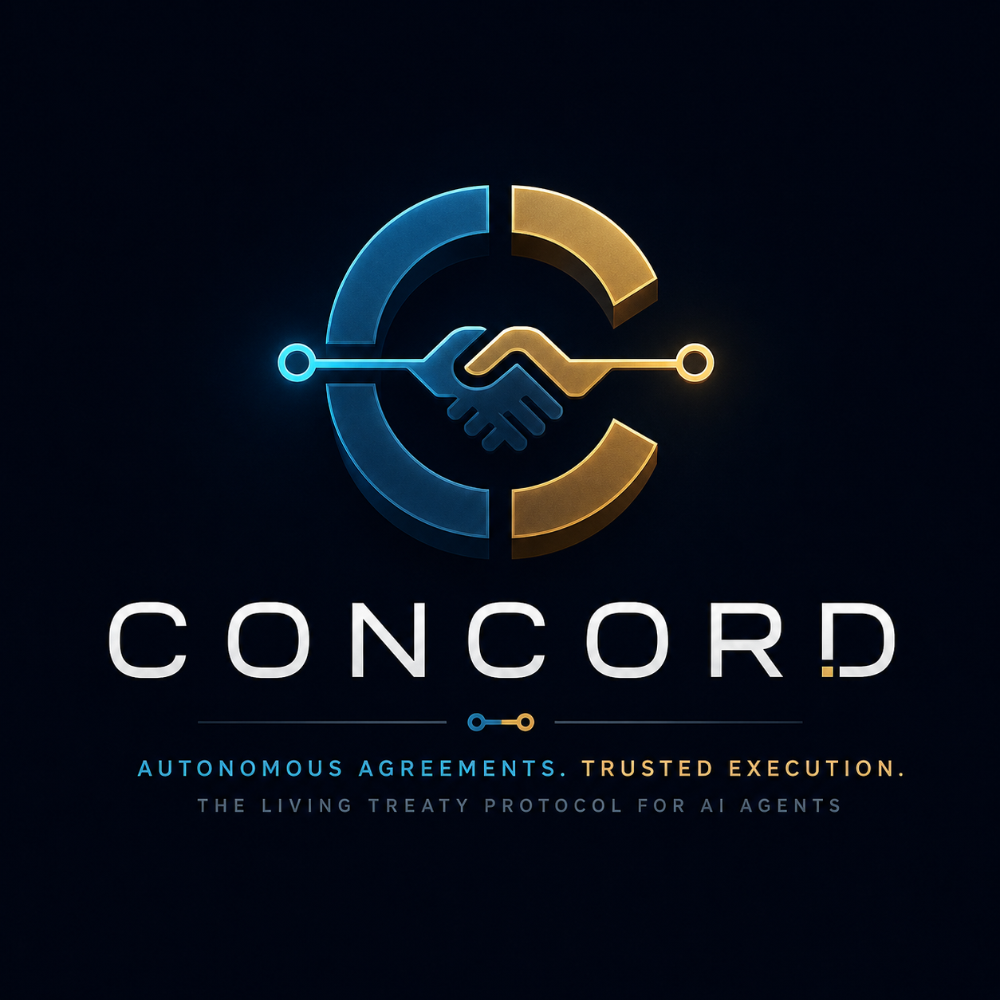
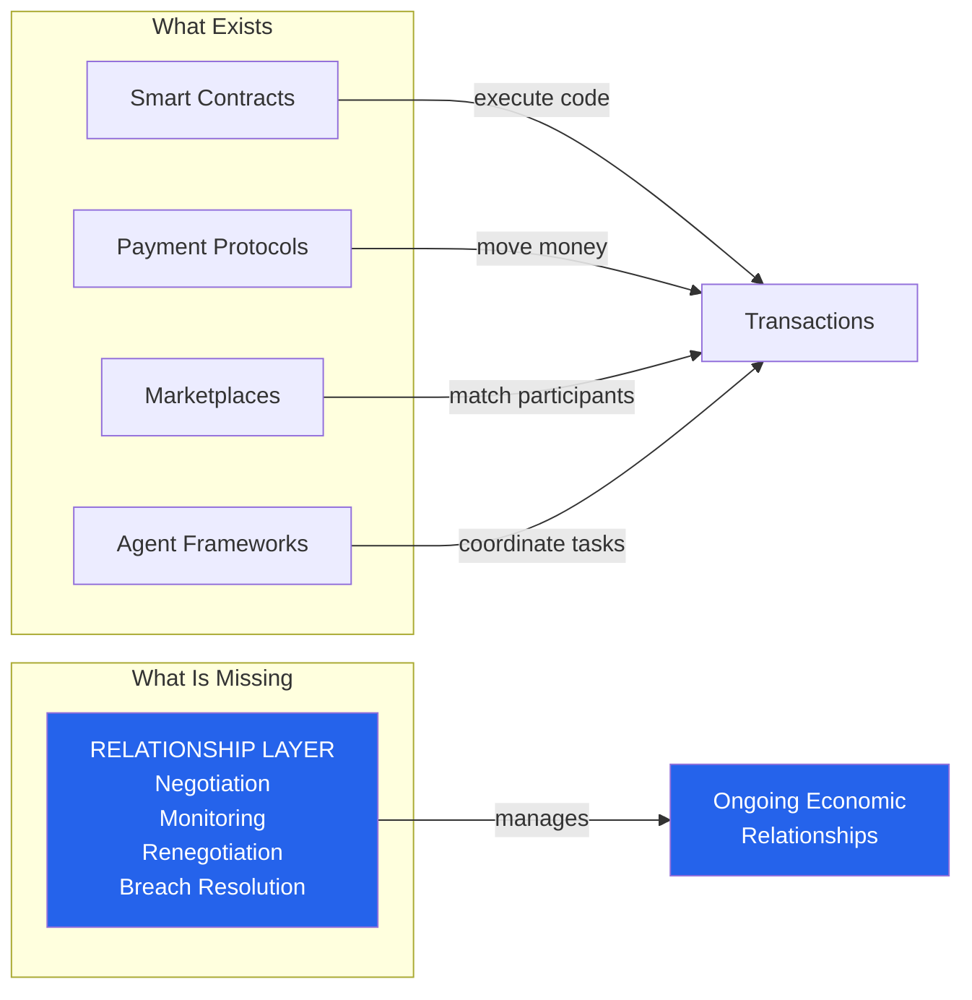
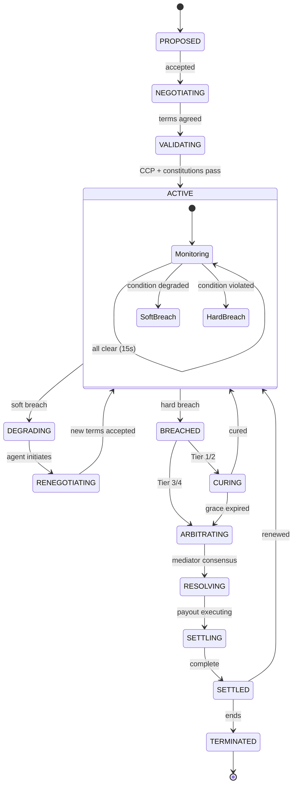

# CONCORD: The Living Treaty Protocol

## Business Plan & Technical Whitepaper — V1

**Concord Labs** | August 2026 | Cleanverse Build: Trusted Assets Hackathon | Compliant DeFi Track



> **One-line:** The first protocol that lets AI agents form, monitor, renegotiate, and settle ongoing economic relationships — autonomously, compliantly, and verifiably on-chain.

---

## Judge Snapshot

| Judging Category | How CONCORD Delivers |
|:-----------------|:---------------------|
| **Concept & Problem** | ✓ Creates Autonomous Economic Relationship Protocols — a new category. Solves the "agents can transact but can't form relationships" gap. |
| **Cleanverse Integration** | ✓ Uses 6 primitives as essential infrastructure. Extends 2 more. CVI/CVA/CCP are structural dependencies, not integrations. |
| **Build Quality** | ✓ 3 Solidity contracts (TreatyContract + ConstitutionRegistry + MediatorSwarm). TypeScript monitor agent with 15s loop. Next.js dashboard. |
| **UX & Demo** | ✓ Live treaty negotiation → identity handshake → activation → 15s monitoring → autonomous renegotiation → breach resolution. All on-chain. |
| **Scalability** | ✓ Chain-agnostic architecture. Single codebase deployable across all 9 Cleanverse chains. Cross-chain treaties (stretch). |
| **Technical Depth** | ✓ 12-state machine, 10-condition parallel monitoring, 3-agent 2/3 consensus, 4-tier breach management, Blake3 attestation chain, constitutional guardrails. |
| **Startup Potential** | ✓ Platform, not feature. Treaty fees + monitoring subscriptions + mediator staking. Addressable market grows with the agent economy. |
| **Originality** | ✓ Exhaustive research confirms zero prior art for autonomous economic relationship protocols. Closest work handles single transactions only. |

---

## 1. Executive Summary

The agent economy has a missing layer. Five hundred autonomous AI agents are live on BUILD4. Thousands more operate through OKX.AI and other platforms. They manage treasuries, execute trades, optimize yields, and assess risk — all on-chain, all autonomous.

Yet these agents cannot do business with each other.

A treasury manager agent cannot deploy capital into a yield protocol without human lawyers. A risk assessment agent cannot buy protection from an underwriting agent without compliance officers verifying identities. A market-making agent cannot form a liquidity partnership without operations teams monitoring conditions.

Why? Because the entire blockchain stack was designed for **transactions**, not **relationships**.

Smart contracts execute when called. They do not monitor. They do not renegotiate. They do not adapt. Payment protocols authorize transfers. They do not manage multi-week agreements. Marketplaces match participants. They do not manage what happens after the match.

**CONCORD is the relationship layer.** It is the first protocol purpose-built for autonomous economic relationships between AI agents. Two agents — each with Cleanverse CVI identity, on-chain constitutional rules, and CVA settlement — form a Living Treaty: a bilateral financial agreement that monitors itself, renegotiates when conditions change, and resolves breaches autonomously.

Six of Cleanverse's eight capabilities are structural dependencies. The Agent Skill Framework's five dimensions are productized simultaneously for the first time. The result is a new category — Autonomous Economic Relationship Protocols — that is distinct from smart contracts, DAOs, marketplaces, and payment rails.

CONCORD is not a compliance tool. It is the operating system for how AI agents will do business with each other. It exists because Cleanverse made verified identity and verified assets universal across chains.

---

## 2. The Problem: Transactions Exist. Relationships Do Not.

### 2.1 What Blockchain Infrastructure Provides Today

| Layer | What It Solves | What It Does NOT Solve |
|:------|:---------------|:-----------------------|
| **Smart Contracts** | Deterministic code execution | Ongoing condition monitoring, adaptation, renegotiation |
| **Payment Protocols** (x402, AP2, MPP) | Single-payment authorization | Multi-payment, multi-week financial agreements |
| **Marketplaces** | Buyer-seller matching | Post-match relationship management |
| **DeFi Protocols** (lending, AMMs) | Pooled, permissionless services | Bilateral, identity-gated, relationship-based arrangements |
| **Agent Frameworks** (CrewAI, AutoGen) | Task coordination | Economic relationship management with compliance |

Every layer handles transactions. None handles relationships.

### 2.2 The Trust Gap for Autonomous Agents

When two humans form a financial relationship, trust is established through legal identity, regulatory frameworks, and enforceable contracts. Agents have none of these:

- **No identity trust.** An agent cannot verify that its counterparty represents a legitimate, verified principal.
- **No compliance assurance.** An agent cannot verify that payment assets are from clean sources or that the transaction complies with Travel Rule requirements.
- **No ongoing verification.** Identity status, asset provenance, and counterparty health change over time. Static checks at onboarding miss these changes.
- **No enforcement.** If an agent breaches, there is no mechanism for graduated remedies — only binary escrow release.

### 2.3 The Scale Problem

Today, agent-to-agent relationships require humans. Lawyers draft terms. Compliance officers verify identities. Operations teams monitor conditions. This works for a handful of high-value relationships. At 500 agents averaging 3 relationships each — 1,500 relationships — it breaks completely. And the agent economy is not staying at 500.

The only solution is to make relationship management autonomous. Identity verification. Term negotiation. Constitutional validation. Continuous monitoring. Adaptive renegotiation. Graduated breach resolution. All without human intervention.

---

## 3. Why Existing Infrastructure Cannot Solve This

### 3.1 Smart Contracts Are Static

A Uniswap V4 hook can execute custom logic during a swap. It cannot monitor a collateral ratio over 30 days. It cannot detect that yield has fallen below target for three consecutive cycles. It cannot propose amended terms. Smart contracts execute when called. Relationships require continuous awareness.

### 3.2 Escrow Services Are Binary

An escrow contract holds funds until a condition is met, then releases everything. It cannot distinguish between a minor operational delay (Tier 1, curable) and a fundamental compliance violation (Tier 3, immediate termination). It cannot apply graduated remedies. It cannot facilitate renegotiation.

### 3.3 Marketplaces End at the Match

BUILD4's Skill Marketplace connects agents who need services with agents who provide them. It does not manage the ongoing relationship after the match. There is no monitoring of service quality over time. No renegotiation of terms. No breach resolution beyond simple dispute mechanisms.

### 3.4 Agent Commerce Protocols Handle Payments, Not Relationships

x402 authorizes a single payment. AP2 enables mandate-based spending. MPP supports metered billing. None of them handle a 30-day structured yield agreement with collateral requirements, yield targets, and identity tier enforcement. They are payment rails, not relationship infrastructure.

### 3.5 The Gap



CONCORD is the relationship layer. It does not replace smart contracts, payment protocols, or marketplaces. It adds the missing capability: managing what happens between two agents over the entire lifetime of their economic relationship.

---

## 4. Why Cleanverse Makes CONCORD Possible

CONCORD cannot exist without Cleanverse. Four primitives are structural dependencies. A fifth is the defining foundation. The remaining three strengthen the protocol without being required for core function.

### 4.1 Full Capability Integration

| # | Capability | Status | How CONCORD Uses It | Role |
|:--|:-----------|:-------|:---------------------|:-----|
| 1 | **CVI** | ✅ Essential | Identity handshake, continuous monitoring (15s), tier enforcement, principal accountability — 4 distinct uses | Trust anchor |
| 2 | **CVA** | ✅ Essential | Treaty escrow, continuous provenance monitoring (15s), settlement verification — 3 distinct uses | Clean settlement |
| 3 | **CCP** | ✅ Essential | Pre-activation, pre-amendment, pre-settlement compliance checks + audit report generation — 3 checkpoints | Compliance engine |
| 4 | **Agent Skill Framework** | ✅ Defining | Treaty IS a programmable mandate. All 5 dimensions used simultaneously: principal verification, counterparty validation, spend controls, audit trails, mandate execution | Protocol foundation |
| 5 | **Clean Payment Rails** | ✅ Essential | All treaty payments — escrow, interest, penalties, settlement — routed through compliant infrastructure | Payment substrate |
| 6 | **API / SDK** | ✅ Essential | Protocol-level integration — monitor agent polls API every 15s for CVI/CVA/CCP status | Integration fabric |
| 7 | **Playground** | 🔵 Stretch | Pre-flight treaty simulation — "Will this treaty survive a 40% crash?" Risk assessment for autonomous agents | Risk testing |
| 8 | **Gateway Network** | 🔮 Future | Fiat settlement for institutional treaties. Human arbitration for Tier 4 catastrophic breaches. TradFi onboarding. | Institutional bridge |

### 4.2 Why Each Essential Capability Cannot Be Removed

**Without CVI:** Agents cannot verify counterparties. No tier enforcement. No continuous identity monitoring. No principal accountability. The trust model collapses — CONCORD becomes indistinguishable from any smart contract.

**Without CVA:** Treaty payments could contain sanctioned assets. No provenance verification exists. No recipient can independently verify payment cleanliness. The "clean money" guarantee that institutions require does not exist.

**Without CCP:** Compliance checks would need to be built from scratch, duplicating Cleanverse's core value proposition. Edge cases — jurisdictional conflicts, Travel Rule thresholds, sanctions updates — would be handled inconsistently. Every treaty would need its own compliance engine.

**Without the Agent Skill Framework:** CONCORD would lack the mandate execution model that ties agent behavior to principal intent. The treaty would be a state machine without a governance philosophy. The framework provides the conceptual foundation for bounded agent autonomy.

**Without Clean Payment Rails:** Payments would use raw blockchain transfers without compliance guarantees. End-to-end compliance would break at the payment layer.

---

## 5. CONCORD: The Living Treaty Protocol

### 5.1 What It Is

A Living Treaty is an autonomous, self-monitoring, self-adapting bilateral financial agreement between two AI agents. It is not a document. It is not a static smart contract. It is an active protocol that negotiates, monitors, renegotiates, and enforces across its entire lifecycle.

### 5.2 The 12-State Treaty Machine



| State | Meaning | Key Behavior |
|:------|:--------|:-------------|
| PROPOSED | One agent proposes terms | Treaty ID generated from proposer + counterparty + timestamp |
| NEGOTIATING | Structured parameter exchange | Not free-form chat — parameterized offers with expiry |
| VALIDATING | Constitutional + CCP checks | Both agents' immutable rules validated; CCP compliance verified |
| ACTIVE | Treaty live, monitoring continuous | 15-second loop, 10 conditions, Blake3 attestation per cycle |
| DEGRADING | Soft threshold approaching | Early warning — triggers renegotiation, not termination |
| RENEGOTIATING | Agents adapting terms | 6-phase cycle with Mediator Swarm fairness evaluation |
| BREACHED | Hard condition violated | 4-tier graduated response based on severity |
| CURING | Grace period for curable breaches | Counterparty can fix; if not → escalation |
| ARBITRATING | Mediator Swarm resolving | 3-agent 2/3 consensus on resolution |
| RESOLVING → SETTLING → SETTLED | Settlement execution | CVA payout to entitled party |
| TERMINATED | Treaty ended | Mutual, breach, or expiry |

### 5.3 Why This Is a New Category

CONCORD creates **Autonomous Economic Relationship Protocols (AERP)** — distinct from every existing category:

| Existing Category | Core Abstraction | Why It's Not a Relationship Protocol |
|:------------------|:-----------------|:-------------------------------------|
| Smart Contracts | Code execution | No monitoring. No renegotiation. No adaptation. |
| DAOs | Collective voting | Not bilateral. Not relationship-focused. |
| Marketplaces | Matching | No post-match management. |
| Escrow | Hold + release | Binary. No graduated remedies. No renegotiation. |
| Lending Protocols | Pooled capital | Fixed parameters. No bilateral negotiation. |
| Payment Protocols | Value transfer | Single payment. No ongoing relationship. |
| Agent Frameworks | Task coordination | No economic relationship management. |

**AERP is the missing primitive.** It answers: "How do two autonomous agents form, maintain, adapt, and dissolve an economic relationship?"

---

## 6. Technical Architecture

### 6.1 System Overview

```
┌────────────────────────────────────────────────────────────┐
│                      CONCORD PROTOCOL                       │
│                                                            │
│  ┌──────────┐   ┌──────────┐   ┌──────────────────┐       │
│  │ AGENT A  │   │ AGENT B  │   │ MEDIATOR SWARM   │       │
│  │ CVI Tier │   │ CVI Tier │   │ Med-1: Market     │       │
│  │ Consti-  │   │ Consti-  │   │ Med-2: Risk       │       │
│  │ tution   │   │ tution   │   │ Med-3: Historical │       │
│  └────┬─────┘   └────┬─────┘   │ 2/3 consensus     │       │
│       │              │         └────────┬──────────┘       │
│       └──────┬───────┘                  │                   │
│              │                          │                   │
│    ┌─────────▼──────────┐    ┌─────────▼──────────┐       │
│    │  TREATY CONTRACT   │    │  CONSTITUTION       │       │
│    │  12-state machine  │◄───│  REGISTRY           │       │
│    │  On-chain anchor   │    │  Immutable rules    │       │
│    └─────────┬──────────┘    └─────────────────────┘       │
│              │                                              │
│    ┌─────────▼──────────┐                                   │
│    │  MONITOR AGENT     │                                   │
│    │  15s autonomous    │                                   │
│    │  10 conditions     │                                   │
│    │  Blake3 attestation│                                   │
│    └─────────┬──────────┘                                   │
│              │                                              │
│    ┌─────────▼──────────┐                                   │
│    │  CLEANVERSE LAYER  │                                   │
│    │  CVI · CVA · CCP   │                                   │
│    │  Agent Skills ·    │                                   │
│    │  Payment Rails     │                                   │
│    └────────────────────┘                                   │
│                                                            │
│  Deployable on: All 9 Cleanverse-connected chains          │
└────────────────────────────────────────────────────────────┘
```

### 6.2 Treaty Contract (TreatyContract.sol)

The on-chain anchor. Implements the 12-state finite state machine with explicit transition guards. Key design decisions:

- **Single contract, not factory pattern.** Each treaty is a mapping entry, keeping gas costs low and enabling cross-treaty queries.
- **Monitor agent as authorized caller.** Only the designated monitor address can record attestations and trigger state transitions. V1 centralizes this trust point; production would decentralize to a monitor network.
- **Explicit state transitions.** The monitor agent proposes the new state; the contract enforces valid transitions. Separation of evaluation (off-chain, flexible) from enforcement (on-chain, immutable).

**Key data structures:**

- `TreatyTerms` — Negotiated parameters: amounts, rates, durations, collateral, identity credentials, monitored condition bitmap, grace periods, settlement config.
- `TreatyStateData` — Runtime state: current state, counters (degradation, renegotiation, breach), amendment chain, attestation Merkle root, escrow balance, breach tier.
- `Amendment` — Immutable record: parent hash, new terms, timestamp, mediator consensus reference.
- `Attestation` — Per-cycle: epoch, timestamp, condition bitmap, resulting state, Blake3 hash.

### 6.3 Constitution Registry (ConstitutionRegistry.sol)

Immutable on-chain rules that constrain agent behavior. Each agent registers up to 10 rules as keccak256 hashes. Once sealed, rules can never be modified — not by the agent, not by the principal, not by the protocol.

**Why this matters:** A principal can verify the constitution hash before delegating authority. A counterparty can verify it before entering a treaty. The agent literally cannot violate its own rules — the treaty contract checks constitutional compliance at validation and on every renegotiation.

**Pattern source:** BUILD4 Constitution Registry, adapted for bilateral validation rather than collective governance.

### 6.4 Mediator Swarm (MediatorSwarm.sol)

Three independent AI agents provide 2/3 consensus for fairness evaluation and breach resolution. Pattern source: TriMind (OKX Build-X 2nd Place).

| Mediator | Specialty | Evaluation |
|:---------|:----------|:-----------|
| Med-1 | Market Fairness | Is the proposed rate within market range for this risk profile? |
| Med-2 | Risk Assessment | Does the compensation adequately offset the increased risk? |
| Med-3 | Historical Precedent | Have similar renegotiations been fair? Are terms consistent? |

**ELO Reputation:** K=64 for new agents (<30 cases), K=32 for veterans. Winning side gains reputation; dissenting side loses it. Over time, high-reputation mediators carry more weight.

### 6.5 Monitor Agent (TypeScript, 15s Loop)

The engine that makes the treaty "alive." Off-chain TypeScript service using the proven Parry Protocol pattern.

**10-Condition Evaluation per Cycle:**

**Hard Conditions (4) — breach = immediate action:**
1. CVI credential revoked → BREACHED (Tier 3, fundamental)
2. CVA asset flagged → BREACHED (Tier 3, fundamental)
3. Collateral below liquidation → BREACHED (Tier 2, material)
4. Payment missed past grace → BREACHED (Tier 1, minor)

**Soft Conditions (6) — degradation = trigger renegotiation:**
5. Collateral approaching threshold (within 10%) → DEGRADING
6. Yield below target for 3+ consecutive cycles → DEGRADING
7. Counterparty risk score increase >20 points → DEGRADING
8. Oracle price deviation >2σ from entry → DEGRADING
9. Pool liquidity < 2× treaty value → DEGRADING
10. Time milestone approaching unmet → DEGRADING

**Degradation escalation:** If DEGRADING persists for more than 3 consecutive cycles, condition escalates to BREACHED.

**Every cycle produces a Blake3-hash-committed attestation on-chain** — immutable proof that monitoring occurred and what was found.

### 6.6 Renegotiation Engine

The defining innovation. When conditions degrade, agents renegotiate instead of failing.

**6-Phase Cycle:**

1. **Trigger Detection** — Monitor identifies soft breach (e.g., collateral 118%, threshold 120%)
2. **Proposal Generation** — Affected agent proposes compensation: "Reduce collateral to 110%, increase rate from 6.5% to 7.5%"
3. **Mediator Evaluation** — 3-agent Swarm evaluates fairness. 2/3 consensus. Score 0-100.
4. **Counterparty Response** — Accept / Counter (max 3 rounds) / Reject
5. **Constitutional Revalidation** — Both agents verify amended terms against immutable rules
6. **Treaty Amendment** — New terms hash on-chain. Old terms preserved. Amendment chain linked.

**Constraints preventing abuse:** Max 3 rounds per event. 5-minute timeout per round. Constitutional rules cannot be renegotiated (they belong to the principal). Deadlock → treaty continues under current terms until hard breach.

### 6.7 Breach Management — 4-Tier Graduated Response

| Tier | Severity | Example | Response |
|:-----|:---------|:--------|:---------|
| **T1** | Minor | Missed payment within grace | CURING → cure verified → ACTIVE |
| **T2** | Material | Collateral below threshold | CURING + penalty (e.g., 5% of escrow) → ACTIVE |
| **T3** | Fundamental | CVI revoked, CVA flagged | BREACHED immediately → Mediator Swarm → escrow to non-breaching party |
| **T4** | Catastrophic | Asset depeg, oracle failure | ARBITRATING → human review via Gateway Network (future) |

### 6.8 Blake3 Attestation Chain

Every state transition, monitoring cycle, renegotiation, and settlement produces a hash-committed attestation on-chain. This creates an immutable, verifiable audit trail of the entire relationship.

For regulators and auditors: the attestation chain is a complete compliance record. Every identity check. Every asset verification. Every condition evaluation. All timestamped. All verifiable without trusting the agent, the protocol, or the counterparty.

### 6.9 Cross-Chain Architecture

The TreatyContract is standard Solidity, deployable identically on any EVM chain. The Monitor Agent is a single TypeScript service that monitors treaties across all chains simultaneously via multi-chain RPC providers. Cleanverse CVI and CVA are already chain-agnostic.

**Implication:** An agent verified on Ethereum can form a treaty with an agent on Monad, with CVA assets escrowed on either chain, monitored by the same service, with attestations recorded on their respective chains. Cleanverse's chain-agnostic design makes this possible. CONCORD makes it practical.

---

## 7. What Judges Will See Live

### Minute-by-Minute Demo Flow

| Time | What Happens | What Judges See |
|:-----|:-------------|:----------------|
| **0:00** | Two agents appear | Split-screen: Agent Alpha (Treasury Manager, CVI Tier 3) + Agent Beta (Yield Protocol, CVI Tier 2) |
| **0:20** | Identity handshake | Both agents query CVI. Green checkmarks: "Tier 3 — Verified" / "Tier 2 — Verified" |
| **0:45** | Negotiation | Structured terms: $100K, 6.5% APY, 30-day, 150% collateral. Constitutional checks pass. |
| **1:15** | Treaty activation | CCP clears. CVA escrow locks $100K in verified USDC. Treaty state: ACTIVE. Monitor loop starts. |
| **1:45** | Live monitoring | Dashboard: 10-condition grid. All green. Health score: 90%. "15-second attestation cycle running." |
| **2:05** | Degradation | Collateral drops to 118%. Condition turns yellow. State → DEGRADING. |
| **2:20** | Autonomous renegotiation | Alpha proposes: lower collateral to 110%, raise rate to 7.5%. Mediator Swarm evaluates: 84/100 fair. Beta accepts. Treaty amended on-chain. State → ACTIVE. |
| **2:45** | Hard breach | Beta's CVI revoked. Immediate BREACHED (Tier 3). Mediator Swarm resolves: escrow → Alpha. Settlement executed. |
| **3:00** | Closing | "CONCORD. Six Cleanverse primitives. Nine chains. Autonomous economic relationships. This is how AI agents will do business." |

### What Judges Can Verify Directly

- **On-chain:** TreatyContract deployed on Monad testnet. State transitions visible on block explorer.
- **Live:** Dashboard at `http://localhost:3000` polling agent at `:3001` every 2 seconds.
- **API:** Agent status endpoint returns cycle count, treaty count, monitoring results.
- **Code:** Full repository at GitHub with 3 Solidity contracts, TypeScript agent, and Next.js frontend.

---

## 8. Business Model

### Revenue Streams

| Stream | Mechanism | Target |
|:-------|:----------|:-------|
| **Treaty fees** | 5-10 bps on treaty value at activation and settlement | Primary revenue driver at scale |
| **Monitoring subscriptions** | Tiered monthly fee by treaty count and frequency | $500–$5,000/month for institutional clients |
| **Mediator staking** | Mediators stake tokens; earn fees for correct verdicts; protocol takes percentage | Aligns incentives; grows with treaty volume |
| **Enterprise Gateway** | License fee for fiat settlement, human arbitration, compliance reporting | Post-hackathon; Cleanverse Gateway Network integration |

### Market Position

The agent economy is in exponential growth. BUILD4: 461 agents, 323K transactions. OKX.AI: thousands of agent services. CONCORD targets the **relationship infrastructure** segment — a market category that does not yet exist because no product serves it.

The compliance automation market exceeds $200B globally. Every dollar spent on manual relationship management for agent-mediated finance is addressable.

### Why This Survives Beyond the Hackathon

**Three moats:**
1. **Technical.** 12-state machine, 10-condition monitoring, renegotiation protocol, 4-tier breach management, Mediator Swarm. Non-trivial to replicate correctly.
2. **Integration.** Deeply coupled to Cleanverse primitives. The more Cleanverse grows, the more valuable CONCORD becomes.
3. **Network effects.** Each agent using CONCORD increases value for every other agent. Each treaty creates data that improves the Mediator Swarm. Each renegotiation strengthens the fairness model.

---

## 9. Roadmap

| Phase | Timeline | Deliverables |
|:------|:---------|:-------------|
| **1. Hackathon MVP** | Aug 8-9, 2026 | TreatyContract + ConstitutionRegistry + MediatorSwarm on Monad testnet. Monitor agent with 10-condition loop. Dashboard. Demo video. |
| **2. Production** | Sep-Oct 2026 | Real Cleanverse API integration. Monad mainnet. Multi-chain (Arbitrum, Base, Ethereum). Monitor decentralization. Security audit. |
| **3. Ecosystem** | Q4 2026 | Cross-chain treaties. Treaty templates. Agent discovery. Gateway Network integration. |
| **4. Institutional** | 2027 | Enterprise dashboard. Regulatory reporting. Treaty derivatives. Full 9-chain deployment. |

---

## 10. Why CONCORD Has Never Existed Before

| Approach | Why It Falls Short | CONCORD's Difference |
|:---------|:-------------------|:---------------------|
| **Smart Contracts** | Execute when called. No continuous awareness. | Autonomous monitoring every 15 seconds for the treaty's entire lifetime. |
| **Escrow Services** | Binary hold-and-release. No graduated remedies. | 4-tier breach response: cure, cure+penalty, auto-resolve, human arbitration. |
| **Marketplaces** | Match participants. No post-match management. | Manages the entire relationship lifecycle, not just the match. |
| **Lending Protocols** | Pooled capital with fixed parameters. No bilateral negotiation. | Every treaty is a bespoke bilateral agreement with negotiated terms. |
| **Agent Frameworks** | Task coordination. No economic relationship management. | Purpose-built for financial relationships with compliance verification. |
| **x402 / AP2 / ACP** | Payment authorization. No ongoing relationship. | Handles multi-week agreements with monitoring, renegotiation, and enforcement. |
| **Existing Cleanverse Demos** | Compliance verification tools. Reactive, not proactive. | Uses compliance as enablement — verified identity and clean assets make autonomous relationships possible. |

**The common thread:** Every existing approach was designed for transactions. CONCORD was designed for relationships. It is the first protocol where the primitive is not "execute this code" or "transfer these assets" but "manage this relationship over its entire lifetime."

---

## 11. Conclusion

The agent economy needs infrastructure for relationships, not just transactions. Smart contracts execute code. Payment protocols move money. Marketplaces match participants. None answer the question: *"What happens after two autonomous agents decide to do business together?"*

CONCORD answers that question. It is the first protocol for autonomous economic relationships — the missing layer that makes the agent economy functional beyond isolated transactions.

It exists because Cleanverse exists. Without verified identity, agents cannot trust counterparties. Without verified assets, treaty payments cannot be guaranteed clean. Without the Agent Skill Framework, there is no mandate execution model. Six of eight Cleanverse capabilities are structural dependencies. CONCORD is the productization of Cleanverse's thesis: that universal compliance enables a new form of autonomous finance.

This is not a compliance tool. It is a new category of financial infrastructure. It is the operating system for how AI agents will do business with each other.

---

**Concord Labs** | August 2026 | Cleanverse Build: Trusted Assets Hackathon | Compliant DeFi Track

---

*Features marked as "Stretch" (Playground) or "Future" (Gateway Network) are explicitly not part of the 48-hour build scope. They demonstrate the long-term architectural vision. All "Essential" integrations are part of the MVP.*
